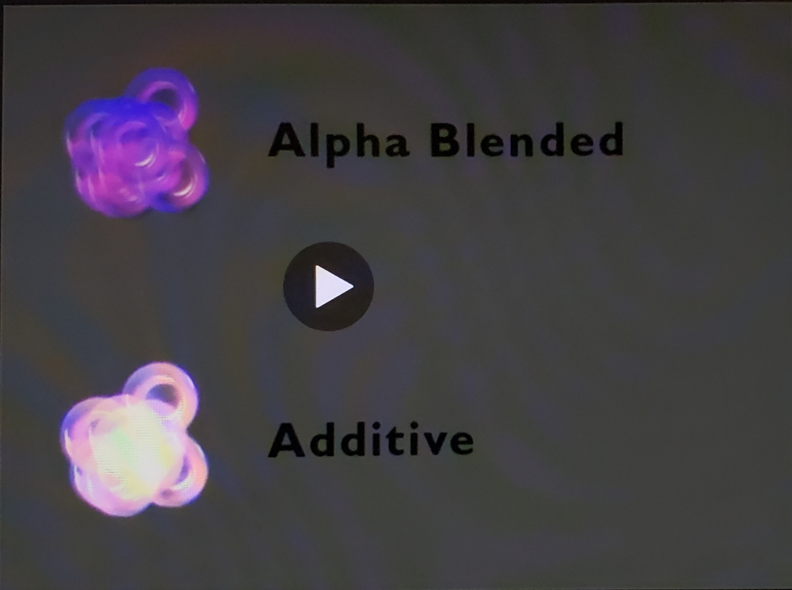

# DEV-02, Type of Effects - Particle Effects
#### Tags: [Particle Effects]

    Particle effects are only made of particle systems. Particle systmes play an important role in creating effects in games.

    Particle effects are often used in combination with shaders.
    Some of the most basic shaders are:
    
    Alpha Blended
    Additive

    Particle effects are also often used in combination with whats called bill boards.

    Bill boards are which are unity Quads with designs on them. (A quad is a cube that only shows one face at a time, so like a plane) its also a square with two triangles

    it is a primitive, one of the most basic way to add effects.