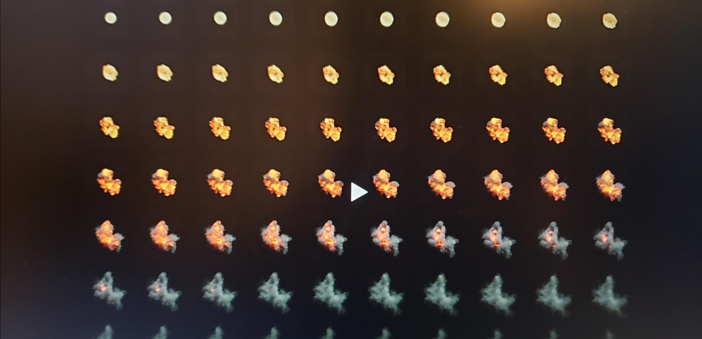

# DEV-04, Flipbook Effects
#### Tags: [Flipbook, Blender, After effects]

    Flip book animations, which are mostly made of previously calculated simulations in another software: Blender, Houdini, 3ds Max or Maya.

    can be useful for creating realistic explosions like this:

    or smoke or fire simulation

    In Blender one could make an animation, like an explosion.

    and then export each frame into a png image

    and at the end, create this flip book animation, also known as a texture sheet animation.

    They can also be hand painted

    This has potential with cell shaded art. Essentially these are 2D effects and can be combined with mesh effects. After effects was another software mentioned to create some of these effects