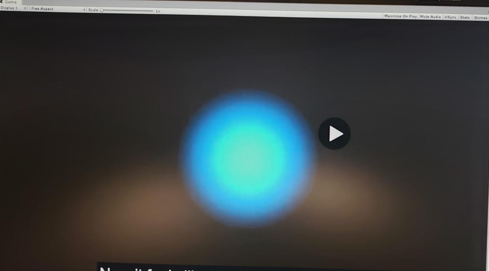

# DEV-08, Principles of VFX | Timing
#### Tags: [principles, timing]

    Timing is crucial in game effects and can be divided into three main parts:

    Anticipation - The build up
    Climax - The explosion
    Dissipation - The aftermath

    in this blue explosion, quick buildup or anticipation may imply that its weak and doesn't do that much damage. Long build up implies that it might hurt and that its best to avoid it.

    Long dissipation may imply that it might cause some status effects or some hp sap. lingering feeling.

    THE WHEN