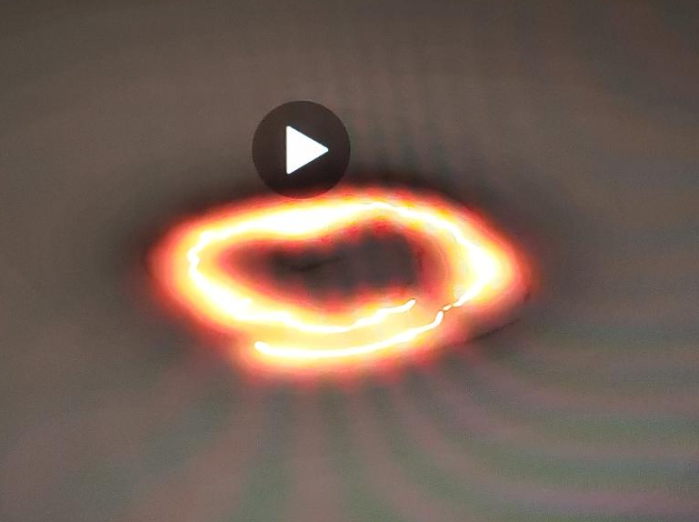
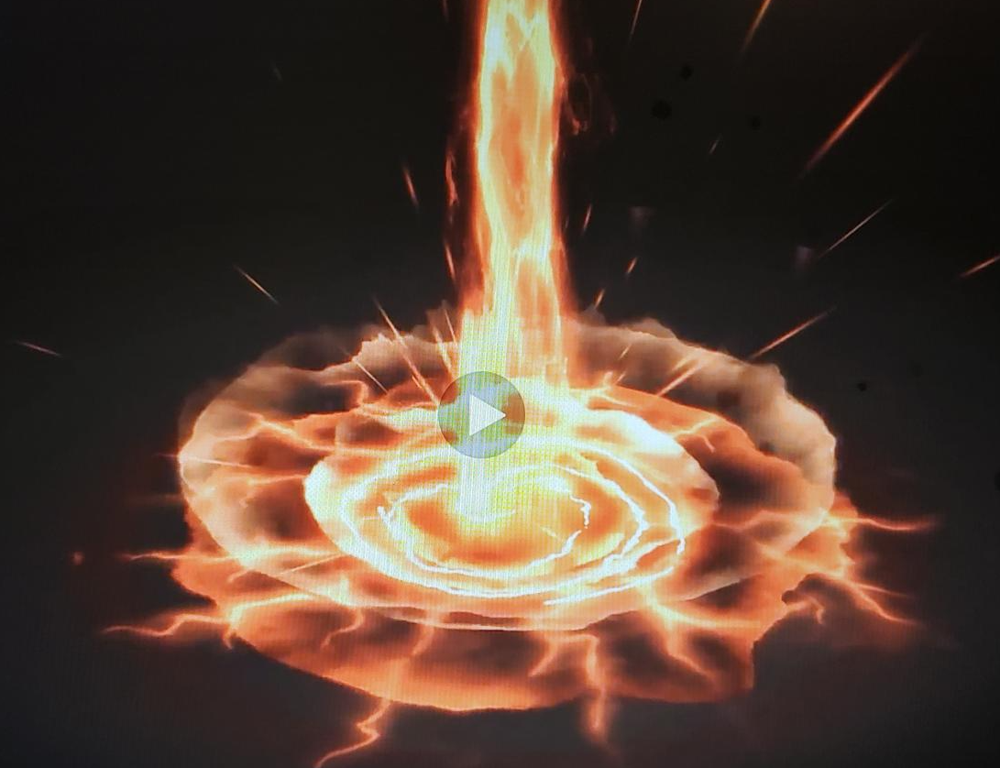

# DEV-09, Principles of VFX | Shape
#### Tags: [principles, shape]

    The spiral tells us where the damage is going to happen. If the player in inside of near the radius, they will take damage. A Shape helps on communicating the intention of the Visual Effect.

    Pointy attacks look like they will really hurt, round shaped attacks sound like they might stun. They have different meanings.

    THE WHAT