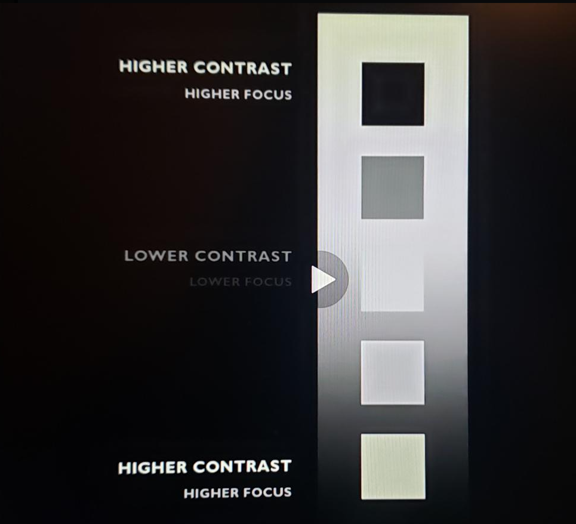

# DEV-10, Principles of VFX | Contrast
#### Tags: [principles, contrast]

    To have a good contrast in an effect means creating a focal point that drives the player's attention quickly.

    Being able to tell which part of an attack was the most bright in a matter of milliseconds. The part that they need to pay most attention to.

    THE WHERE