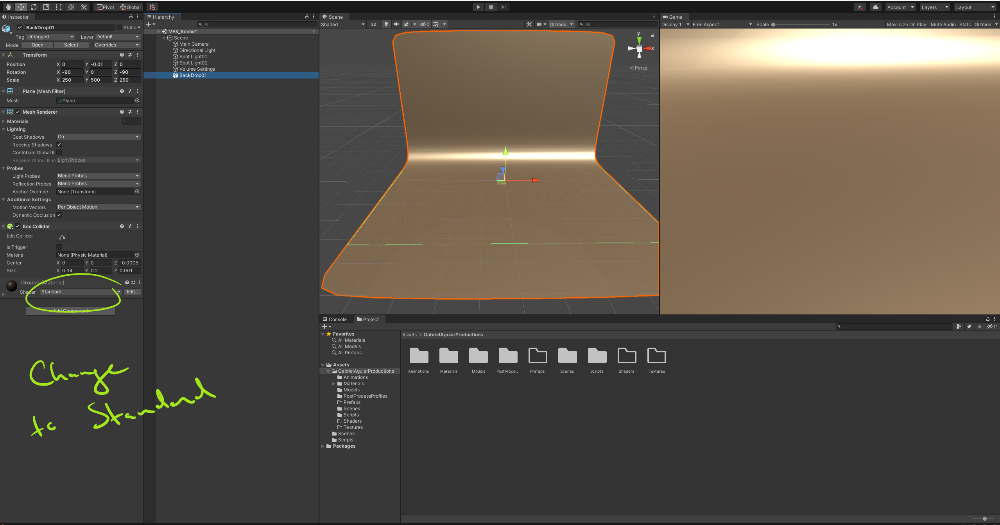
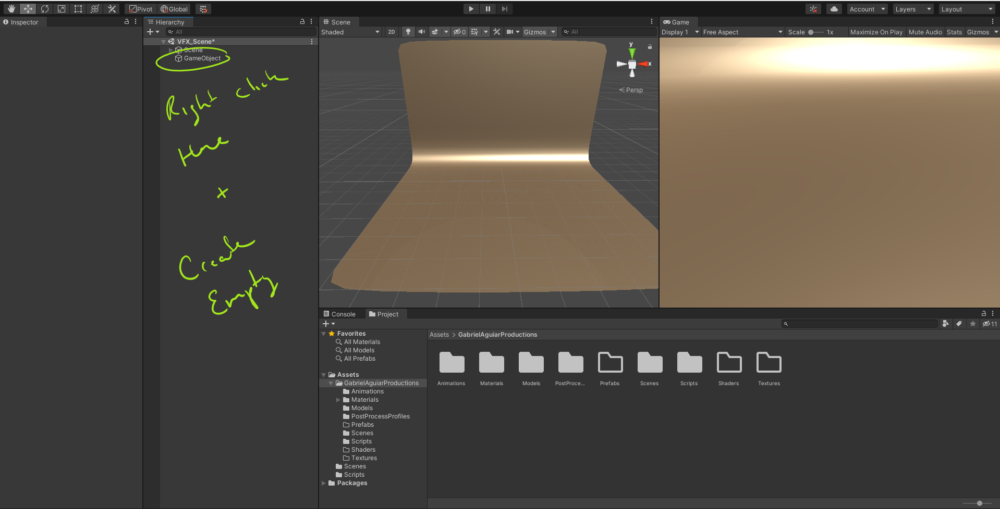
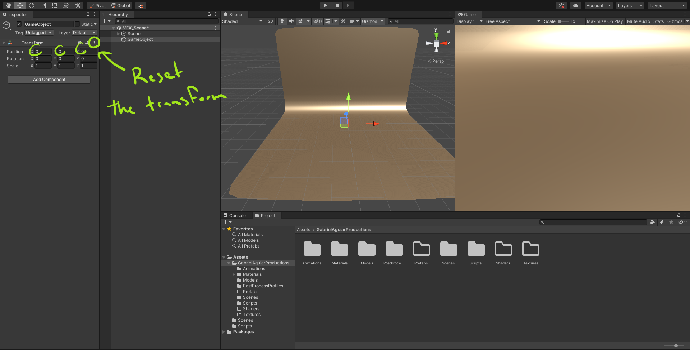
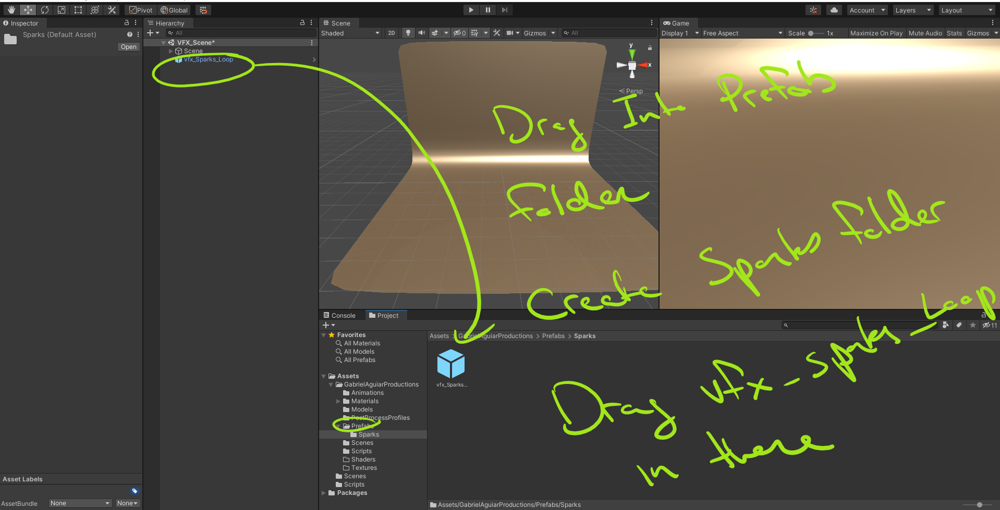
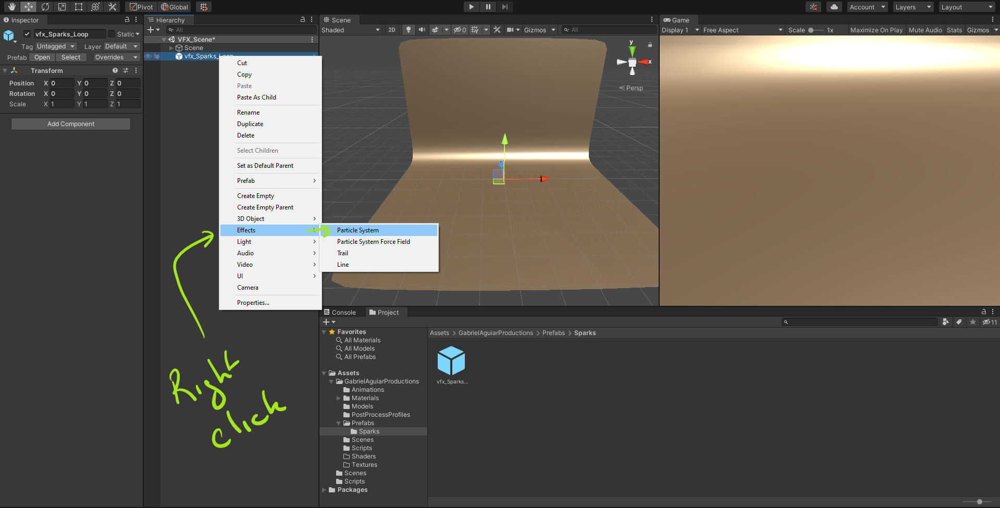
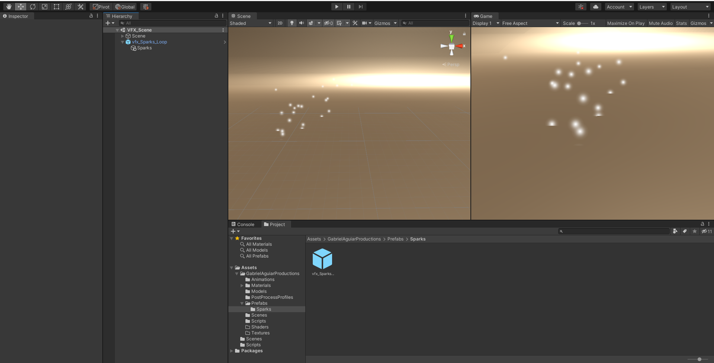

# DEV-14, Creating Sparks
#### Tags: [creating]

## Set up

    Be sure to update the Backdrop to standard. Seems to be slightly broken on arrival in recent versions.

    To build a visual effect in unity, first create an empty game object 

    Be sure to reset its position in the world space, resetting the transform

## Naming conventions

    Be organized, Don't leave textures, materials and effects unnamed
    
    Example:
    
    vfx_<Name>_<Additional Features>
    Actual:
    vfx_Sparks_Loop

## Adding prefabs

## Creating Particles

If for some reason its pink/magenta squares then the material is not rendering correctly on the particles. You can see that you can apply a default material for the time being.

## NOTE: Review on old projects

https://github.com/MuteBard/BlockBreaker
https://github.com/MuteBard/LaserDefender
https://github.com/MuteBard/ObstacleCourse
https://github.com/MuteBard/ProjectBoost
