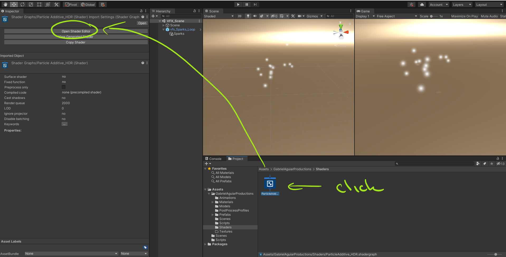
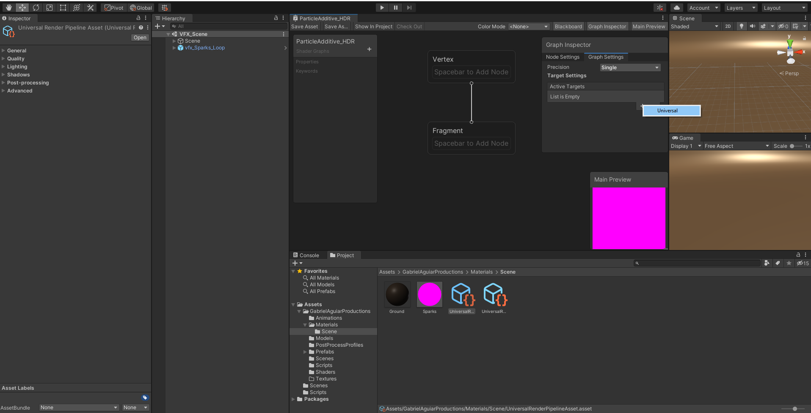
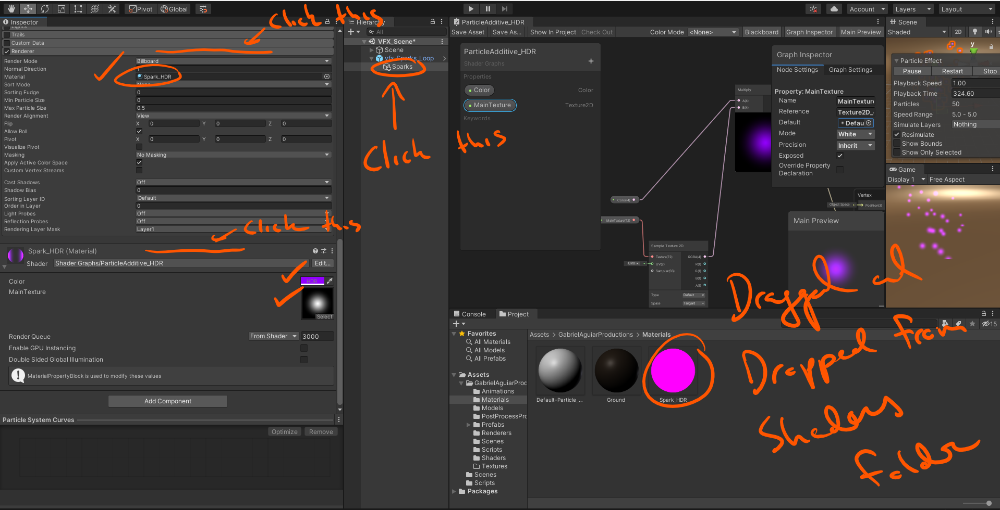

# DEV-15, Shader Graph
#### Tags: [Shader Graph]

## What is Shader Graph?
    It is a visual scripting tool, that uses nodes created by unity to easily develop shaders.

## Installing Shader Graph

    Window > Package Manager

## Installing the Universal RP (Render Pipline)

    1 - Install the Universal RP

    2 - Create a Pipeline Asset

    3 - In Edit > Project Settings > Graphics, Change Scriptable Render Pipeline Settings asset to the asset you just created. 

    4 - In Edit > Project Settings > Quality, Remove the Levels (of quality) except for the last then change the Rendering field to the pipeline asset you created.

    5 - You will probably need to update your materials for everything to work. Go to Edit > Render Pipeline > Universal Render Pipeline > Upgrade projects materials to UniversalRP Materials

   

## Adding our first Shader
    An unlit shader is a shader that does not receive light information, it does not have shadows as well.

    In terms of performance, it is ver lightweight which is good and we can rename it to:
    
    PariticleAdditive_HDR

    HDR stands for High Dynamic Range, Which will be useful to control the intensity of our colors.

## Opening Shader Graph

    Vertex stands for everything regarding the geometry. Where are the vertexes going to be rendered.

    Fragment stands for how you color those.

    Everytime we make a change to a shader, we need to save asset so that we can see our applied changes

## Properties Panel

    Properites Panel is where we can add textures, colors, vectors and other properties that will be available in the inspector.

    If you right click on the preview, you can turn it into a quad

## Main Preview

## Setting our Shader to universal and unlit

    Set the Active target to Universal

    Voila

## Setting our Shader's Universal settings 

    Make it both transparent, Additive and two sided

## Adding to our Shader

    We need to add two properties to the shader right away. 
    
    The first one is the texture 2D.
    Rename it to 'MainTexture'. This property will be useful to us so we can assign a texture in the inspector. Textures are extremely important when creating visual effects for games.
    That is what will give it that certain art style.

    The second one is the color. Be sure to change the mode to HDR, set color to white and opacity to 100%

## Connecting our new nodes

    Be sure to drag both the Main Texture node and the Color node from the side window into the main window

    Press spacebar to bring up the search menu below

    Added!

    Now connect the MainTexture node to the Sample Texture 2D node

    If we want to add the color node, we want to make sure it colors our texture, not just plain color to our fragment base color. So like so:

    All connected!

## Checking on how this is affecting our particle system.

    Be sure to press the Save Asset button in the top left corner

    First thing is that we cannot assign shaders directly to our particl system but we can assign materials. A material is nothing more than instance of a shader. If you change the shader, you change the material. An shaders can also have several material instances.

    Create a material and then add it to our particle system sparks, within the renderer

## Retaking control in the particle menu

    If you try to change setting through the particle menu, it will fail. The shaders graph will not allow it by default. we can fix this.

    Adding the Vertex Color node will help us regain that access

