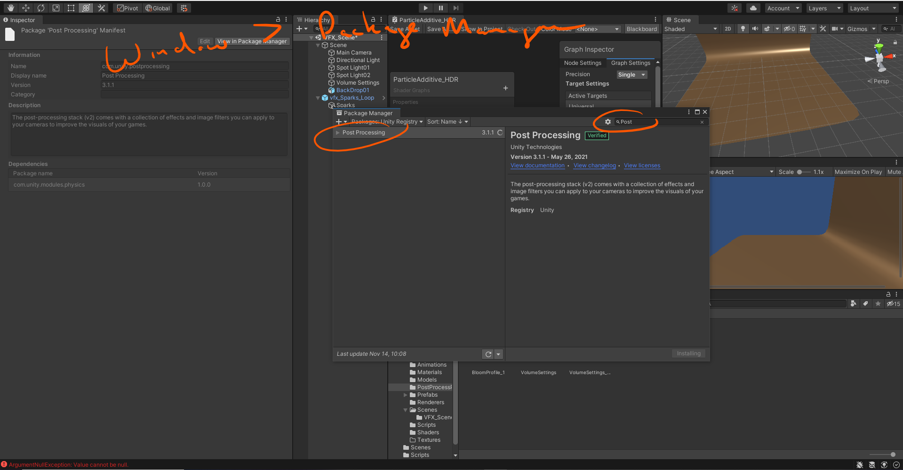

# DEV-16, Making our spark
#### Tags: [bloom, particles]

    NOTE: This has failed, you cannot have both Universal RP and Post Processing, Universal RP comes with its own post processing and we gotta find out how to use it

## Adding Bloom Effect

    https://www.youtube.com/watch?v=c8hnKnXxGn8

    Go to the Windows > Package Manager and install Post Processing

    Add this component, post processing layer, to the Main Camera

    Add a new Layer, called Glow

    Add this component, post processing volume,  to our target object, Sparks

    Set all post processing effects to happen on layer "Glow"
    

    Create a post processing file

    Add newly created post processing file and adjust settings for post processing volume component

