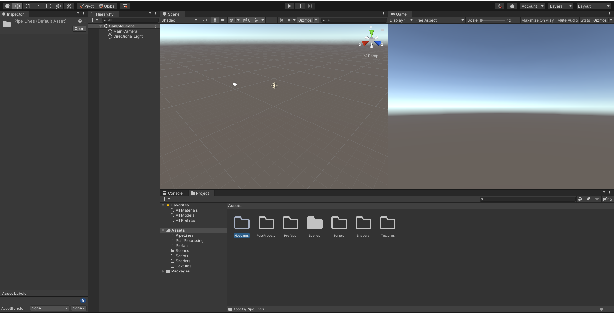
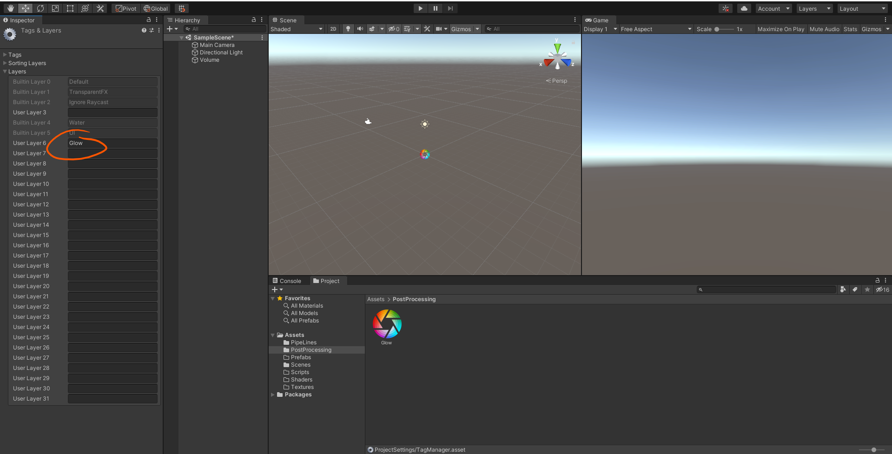
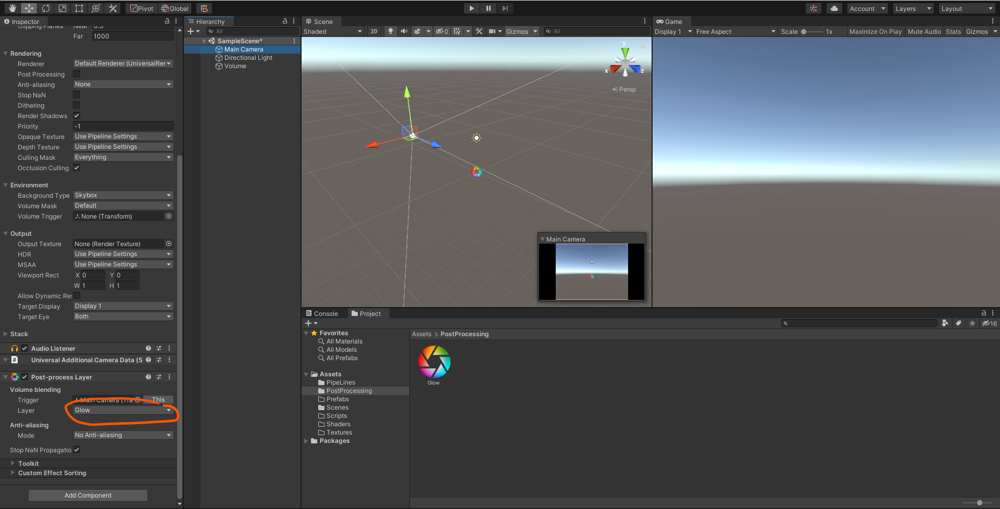
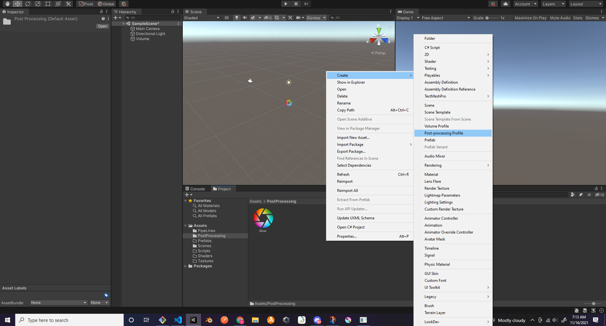
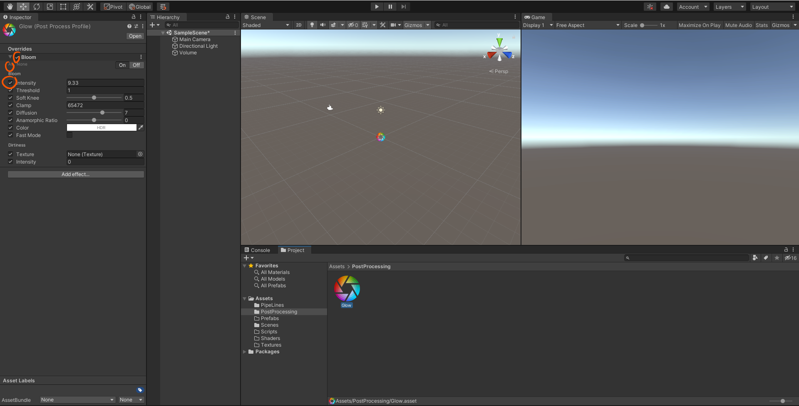
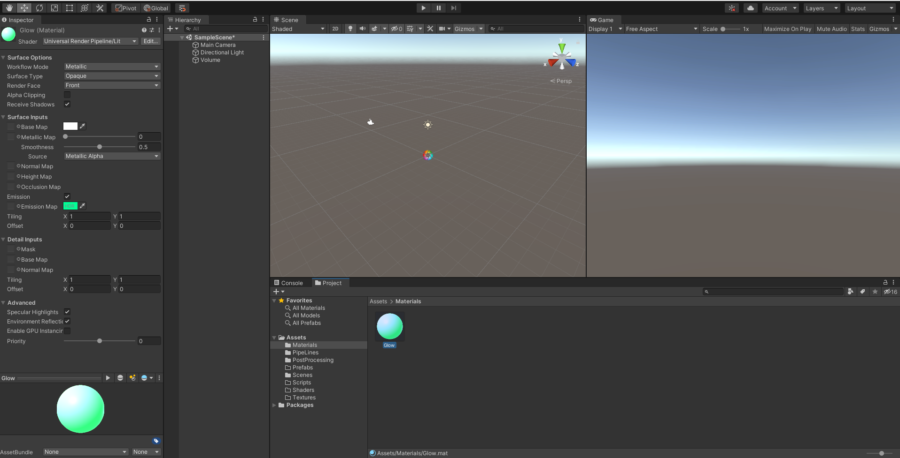

# DEV-17, REDO Bloom 
#### Tags: [redo, bloom]

    NOTE: This has failed. You cannot have both Universal RP and Post Processing, Universal RP comes with its own post processing and we gotta find out how to use it

    Creating my folders

    Refer to DEV-15 and DEV-16 to installing Shader Graph, Universal RP (Render Pipline) and Post Processing

    Create a Layer called Glow

    Add the Post Processing Layer component to the main Camera

    Create a Post processing profile

  

    Turn on Bloom

  

    Add the Post Processing Volume component to new Empty called Volume and add the post processing profile

    Add a Material folder and Material

    Create a cube and add the newly added material

