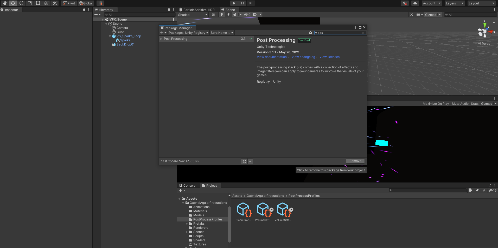
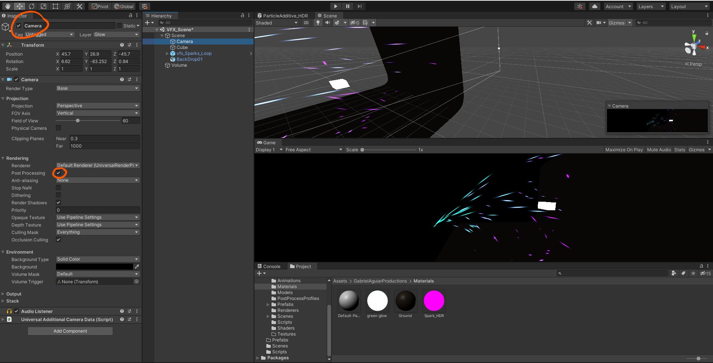
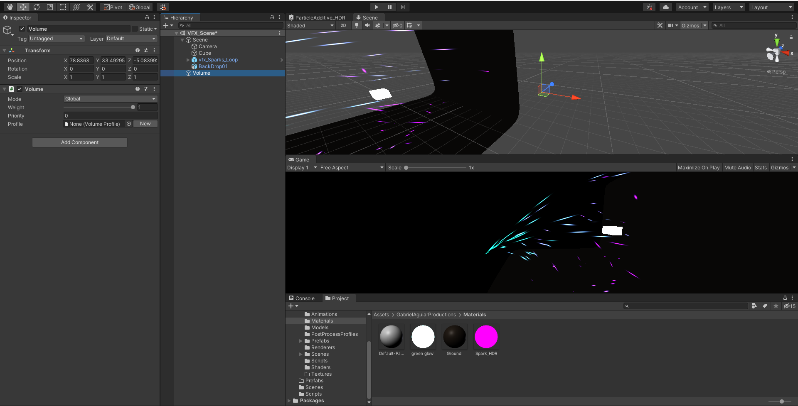
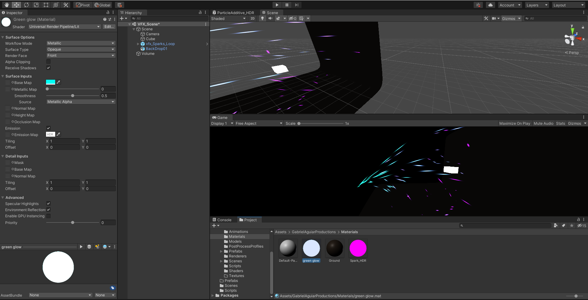
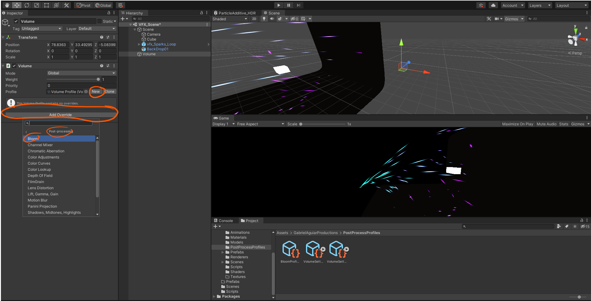
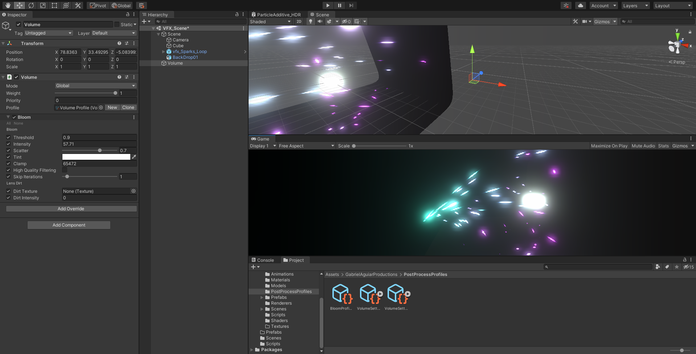
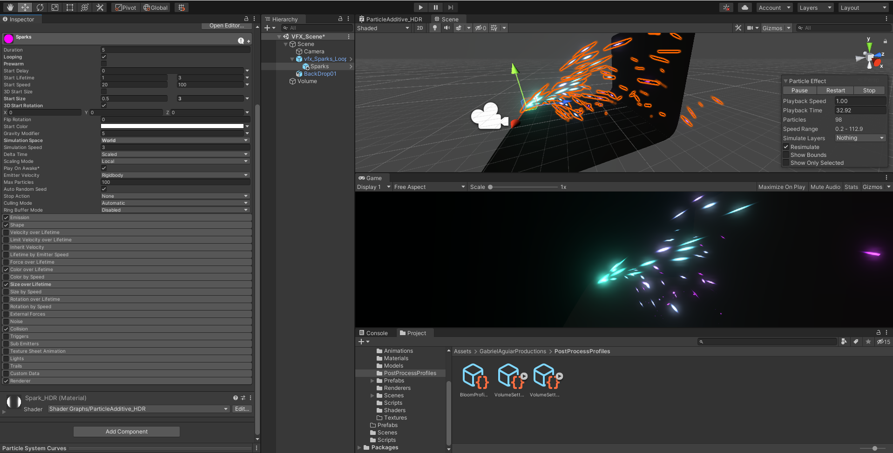
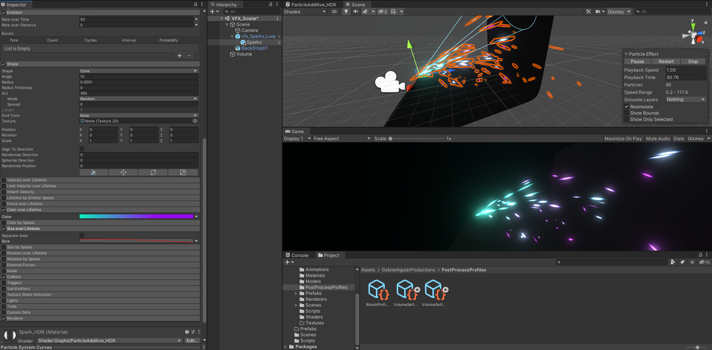
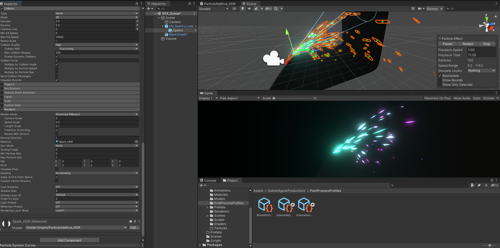

# DEV-18, Making our spark
#### Tags: [particles]

## Removing everything that has to do Post Processing import

## Adding Bloom

    Turn on post processing within the Camera (This is Universal RP's own post processing)

    Create a Volume and add the volume component (you will have this script if you have Univeral RP installed)

    Make sure that our cube is emitting light

    Create new profile and then select bloom

  

    Awesome!

  

## Particle Settings for sparks

 

 

 