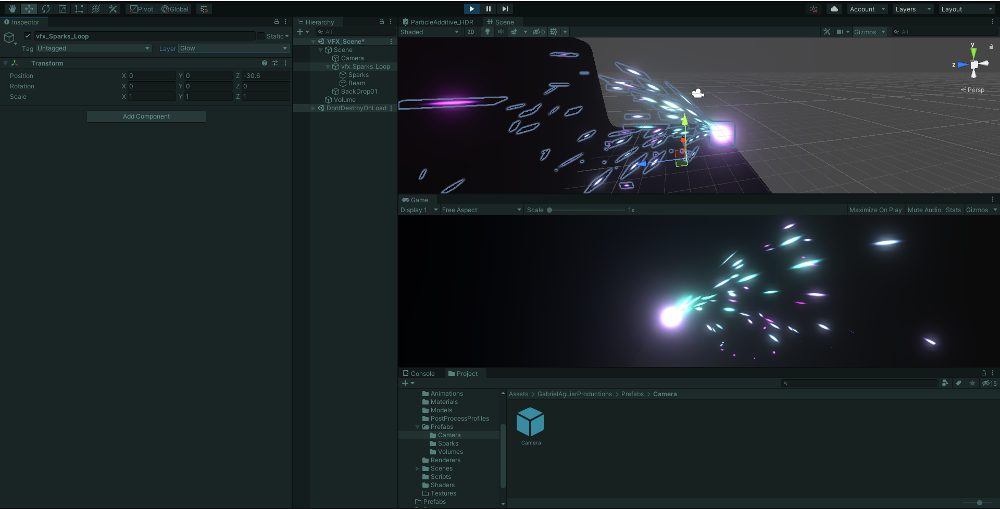
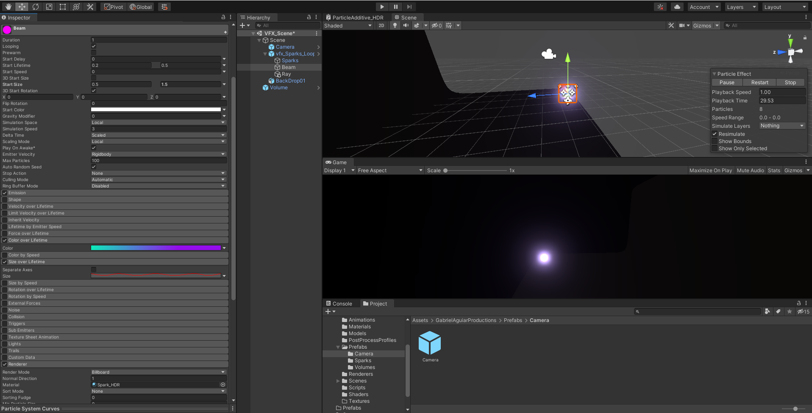
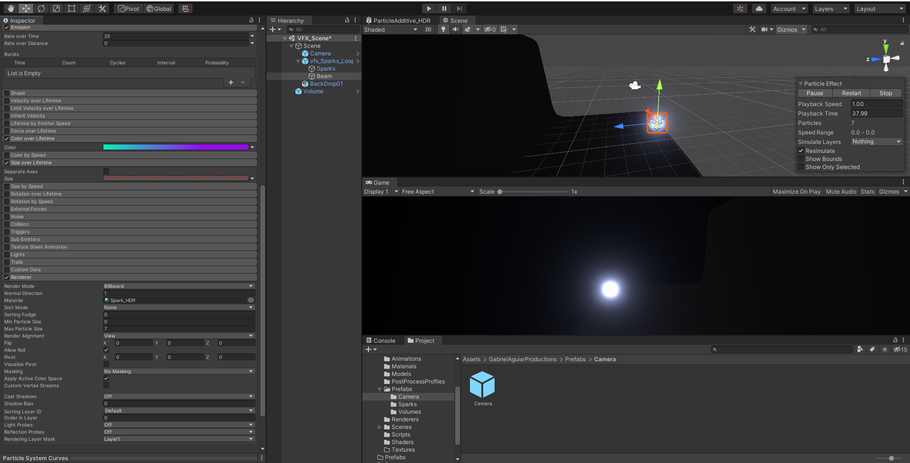
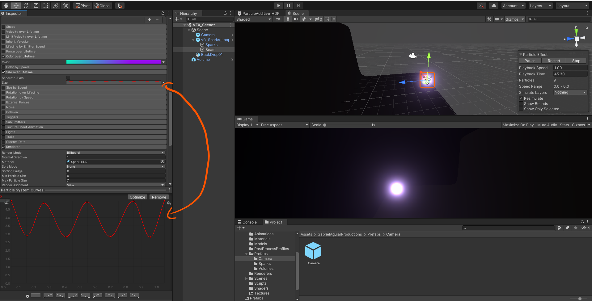
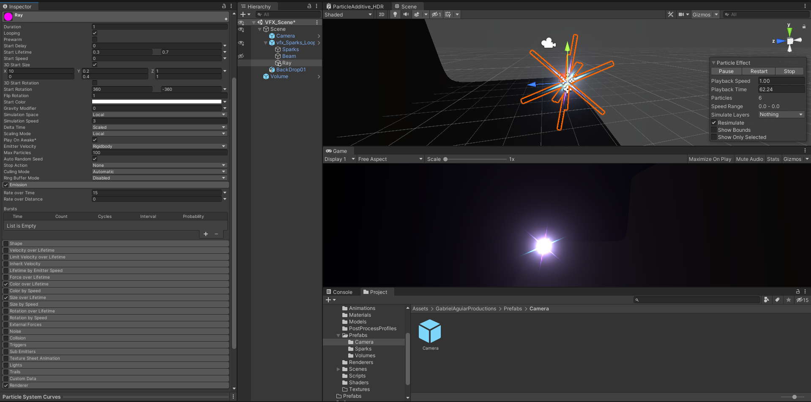
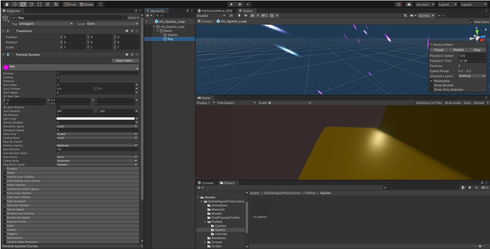
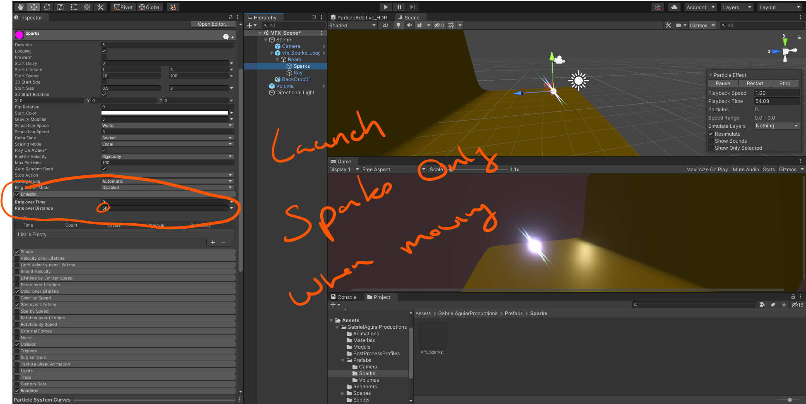

# DEV-19, Creating a beam and rays in our spark
#### Tags: [particles, emit while moving, gifs]

## Added a Beam

    Duplicate from Sparks with these settings changed

## Settings

## Added Rays

    Duplicate from Beam with these settings changed

## Parenting

    Parent the sparks and rays to the beam

## Emit by distance

    This will cause sparks to fly only when it is forced to move

## Gif converter

https://ezgif.com/video-to-gif