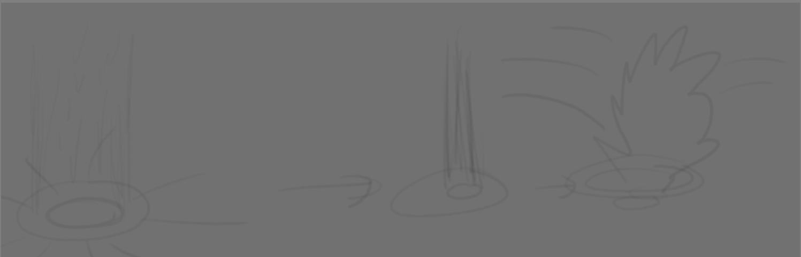
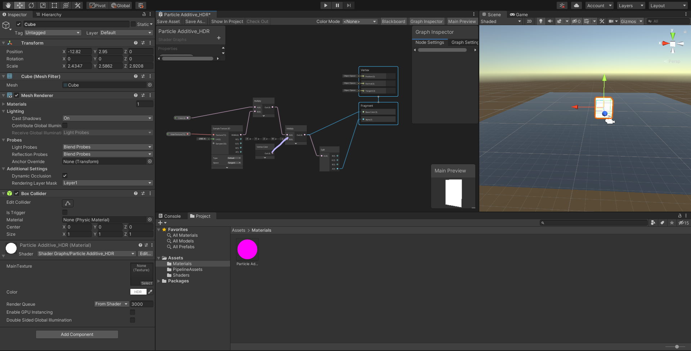
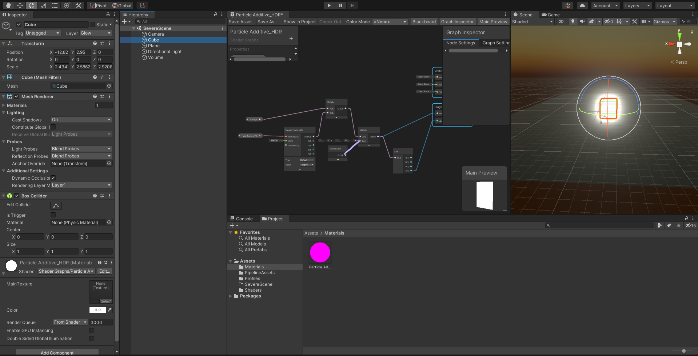

# DEV-21, Area of Effect Attack
#### Tags: [References, sketches, HotKeys]

## HotKeys
    https://docs.unity3d.com/2018.1/Documentation/Manual/UnityHotkeys.html

    Tools
    Keystroke	    Command
    Q	            Pan
    W	            Move
    E	            Rotate
    R	            Scale
    T	            Rect Tool
    Z	            Pivot Mode toggle
    X	            Pivot Rotation Toggle
    V	            Vertex Snap
    CTRL/CMD+LMB	Snap

## Sketches

    Im not good at it YET, but be sure to draw sketches before you start unity

## Set Up
    Starting from a new project, delete everything from the scene
    Install Universal RP and Shader Graph (Refer to DEV - 15)
    Wire up Universal RP (Refer to DEV - 15)
    Create our Shader Graph (Refer to DEV - 15)
    Assign an instance of our graph to something like Cube

    Create a bloom effect and keep it on stand by for when we want to apply it later (Refer to DEV - 18)

    Import the particle effects from DEV-20 and DEV-19

## Anticipation, creating the beam

    Create a new Empty and particle object
    Duplicate the Particle additive material and duplicate it
    Increase the Max Particle size to 3.

# RESUME STUDY AT TIMESTAMP 2:00 OF LECTURE 30, ANTICIPATION, CLIMAX AND DISSIPATION

