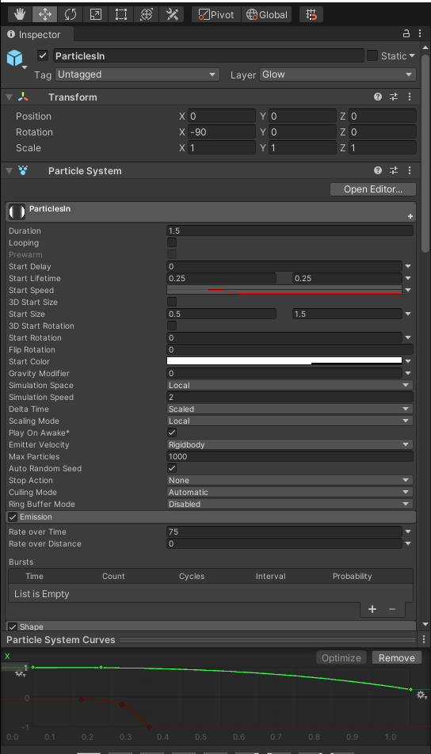

# DEV-21, Area of Effect Attack
#### Tags: [References, sketches, HotKeys]

## HotKeys
    https://docs.unity3d.com/2018.1/Documentation/Manual/UnityHotkeys.html

    Tools
    Keystroke	    Command
    Q	            Pan
    W	            Move
    E	            Rotate
    R	            Scale
    T	            Rect Tool
    Z	            Pivot Mode toggle
    X	            Pivot Rotation Toggle
    V	            Vertex Snap
    CTRL/CMD+LMB	Snap

## Sketches

    Im not good at it YET, but be sure to draw sketches before you start unity

## Set Up
    Starting from a new project, delete everything from the scene
    Install Universal RP and Shader Graph (Refer to DEV - 15)
    Wire up Universal RP (Refer to DEV - 15)
    Create our Shader Graph (Refer to DEV - 15)
    Assign an instance of our graph to something like Cube

    Create a bloom effect and keep it on stand by for when we want to apply it later (Refer to DEV - 18)

    Import the particle effects from DEV-20 and DEV-19

## Creating the beam

    Create a new Empty and particle object vfx_AreaOfEffect_v1
    Duplicate the Particle additive material
    Create a new particle instance under vfx_AreaOfEffect_v1 called BeamGround

### managing its texture
    Apply the Particle additive material to BeamGround's [Shader][MainTexture]

### managing its color
    Decrease Start Color Opacity to 50%
    
### managing its frequency
    Decrease BeamGround's [Emission][Rate over Time] to 0
    Add [Emission][Bursts] with a count of 1

### managing its duration
    Decrease BeamGround's start Speed to 0

### managing its direction and movement
    Uncheck [Shape] because we want this effect to be in thr center of the system
    Apply [Renderer][Render Mode] to Horizontal Billboard to be parallel to the ground

### managing its size
    Increase BeamGround's [Renderer][Max Particle Size] to 3
    Increase BeamGround's Start Size to 49

### Managing is transitions
    Manage the [Color over Lifetime] as such

    Decrease size over time using the [Size over Lifetime] module and pick a downward curve

## Creating the BeamGround settings

### Progress so far

## Creating the ParticlesIn settings

### Progress so far

## Coloring the area of effect

### Updated Shader

    Updated the shader so that the material can have to have more contrast

### Updated BeamGround settings

### Updated ParticlesIn settings

### Progress so far

## Additional changes made to particles

    Refer to export DEV-21(final) to see details

### Progress so far

