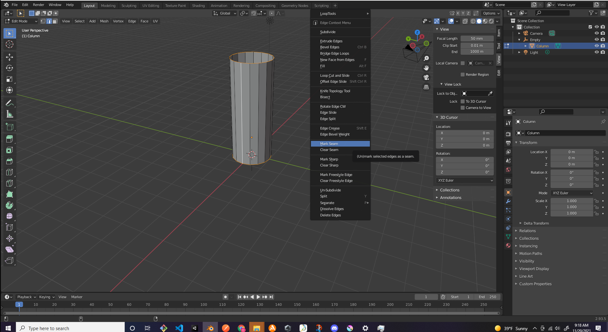
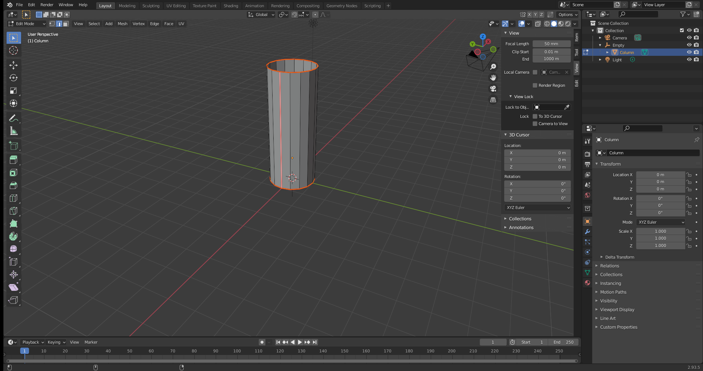
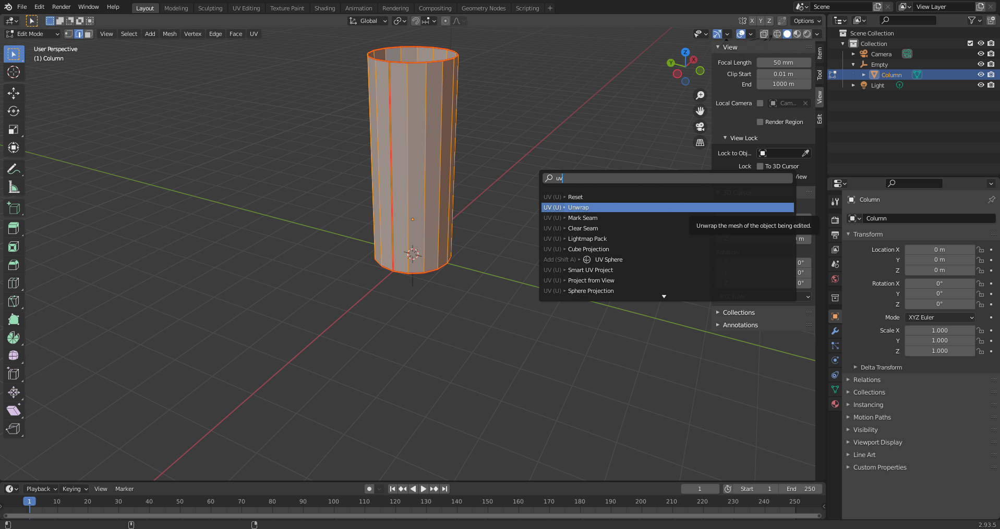
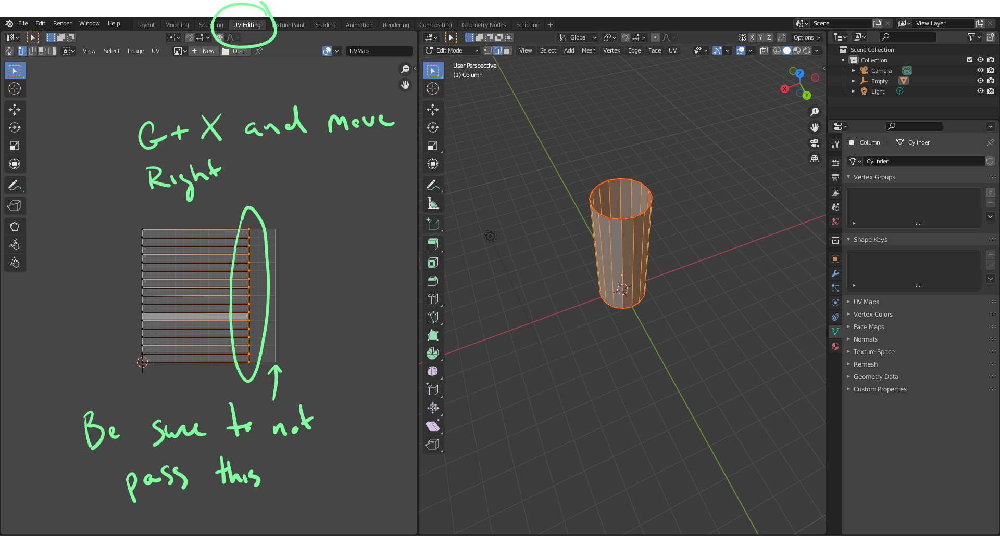
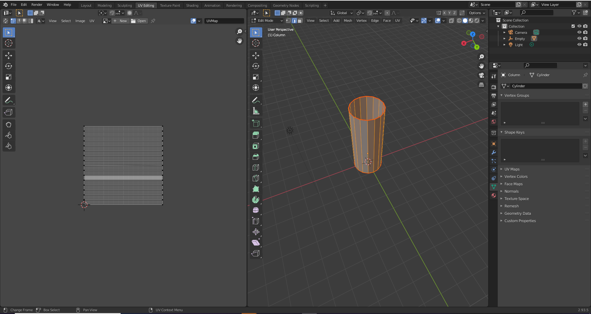
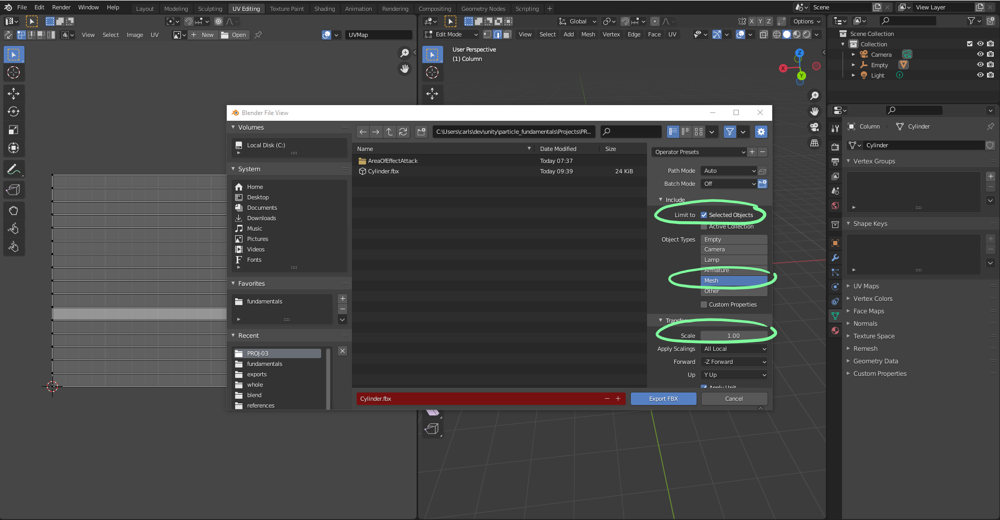
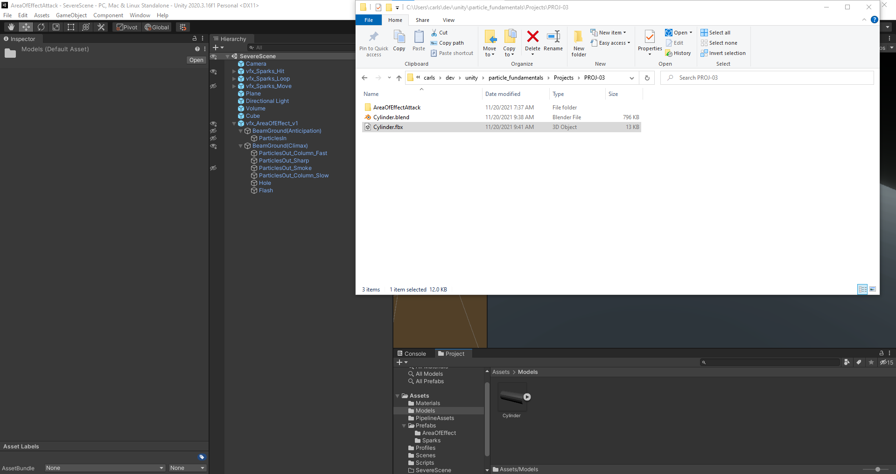

# DEV-22, Blender creating a mesh
#### Tags: [Blender, mesh]

    Look at Blender fundamentals repo for assistance

## Creating the mesh

    Create a cylinder and in edit mode delete both the top and bottom faces.
    Select all the bottom vertices and in object mode create empty based on that position.
    Parent the cylinder to the empty
    Then snap the empty to the 3d cursor who is at origin
    Then select the folowing edges and right click select 'Mark Seam'

    Then with F3, unwrap as such

    export both the blend file and the fbx file of the cylinder

    Import the fbx file to unity

