# DEV-23, Projectiles
#### Tags: [particles, mesh, blender, proportional editing, shade smooth, UV Mapping]

## Sketches

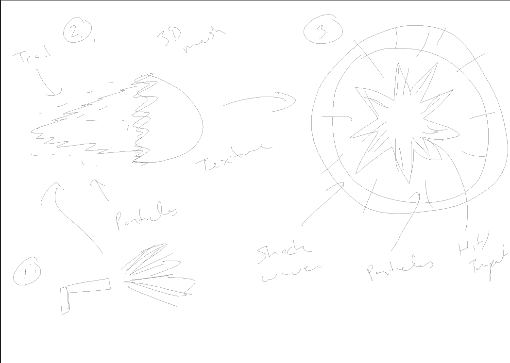

## Initializing our projectile

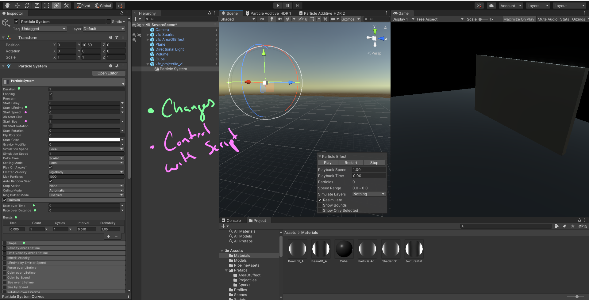

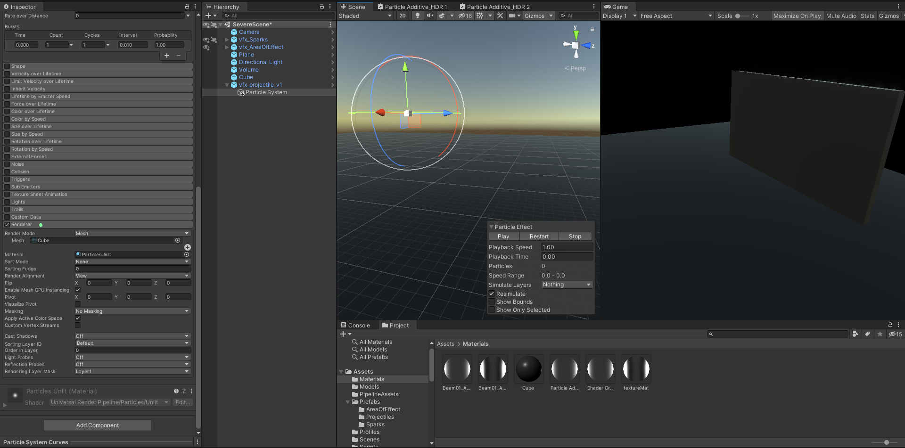

## Creating our blender mesh

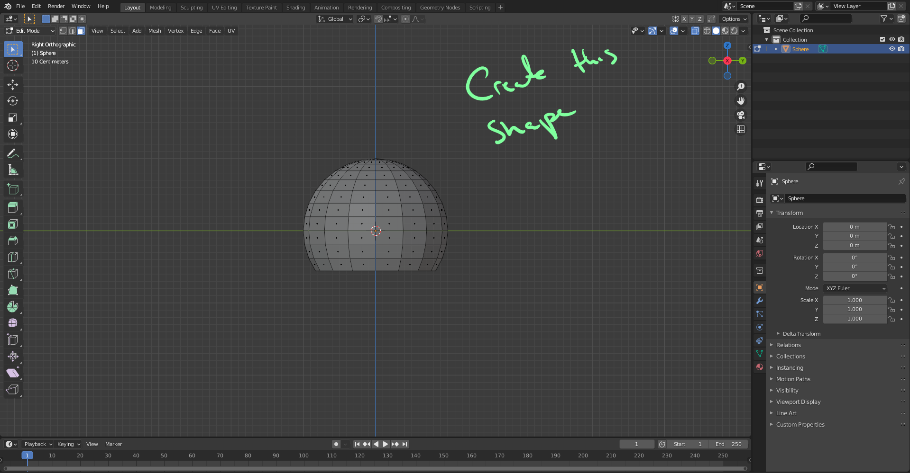

    Use O to turn on proportional editing
    When a circle of influence appears, you can control its size with the mouse wheel

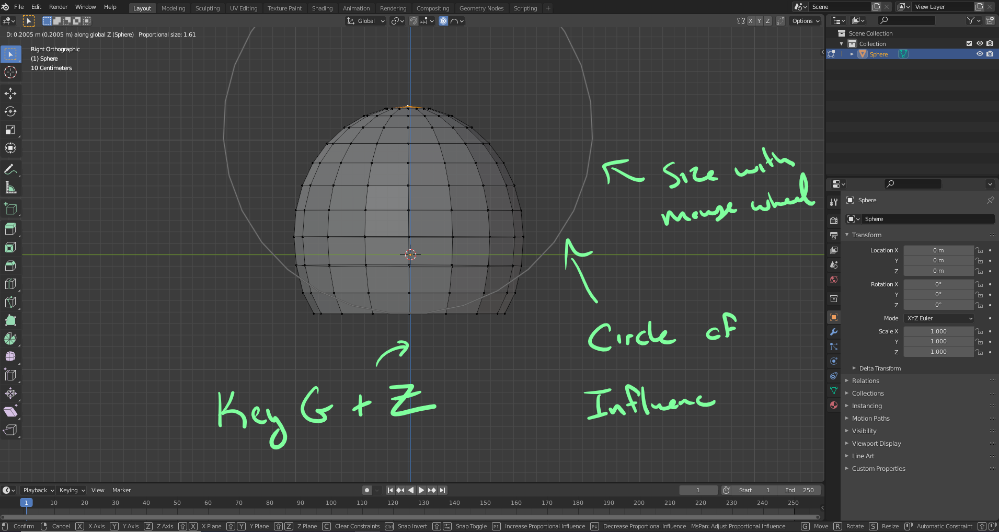

    Apply some smooth Shading

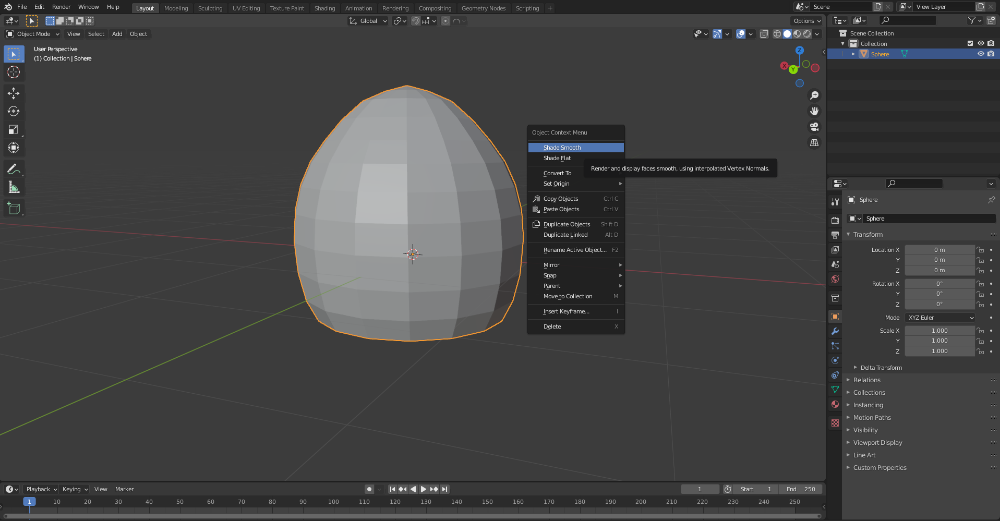

## Begin UV Mapping

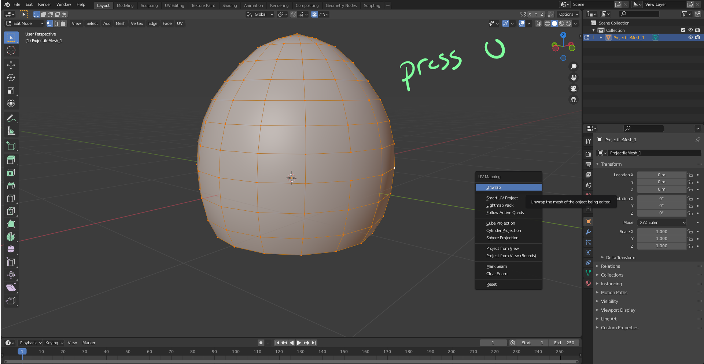

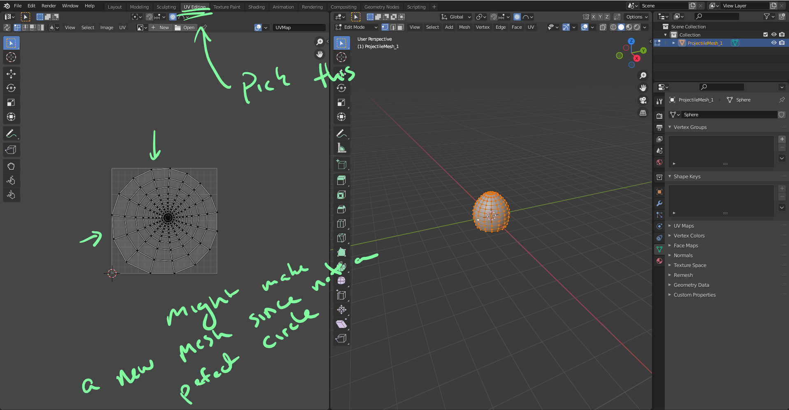

## Exporting FBX

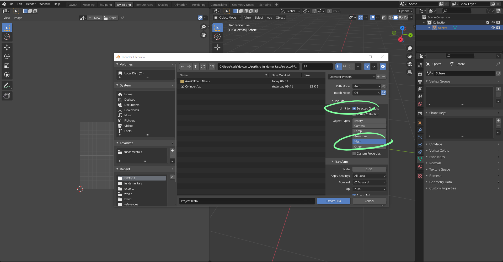

## Back in unity and importing our mesh

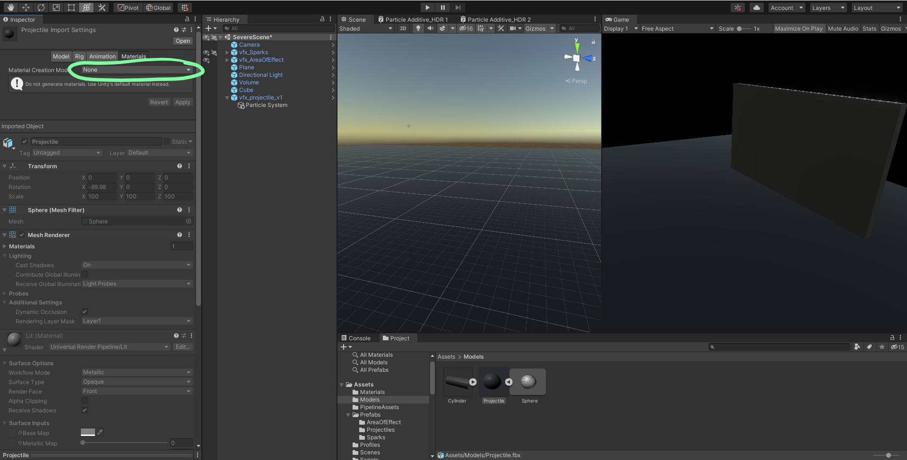

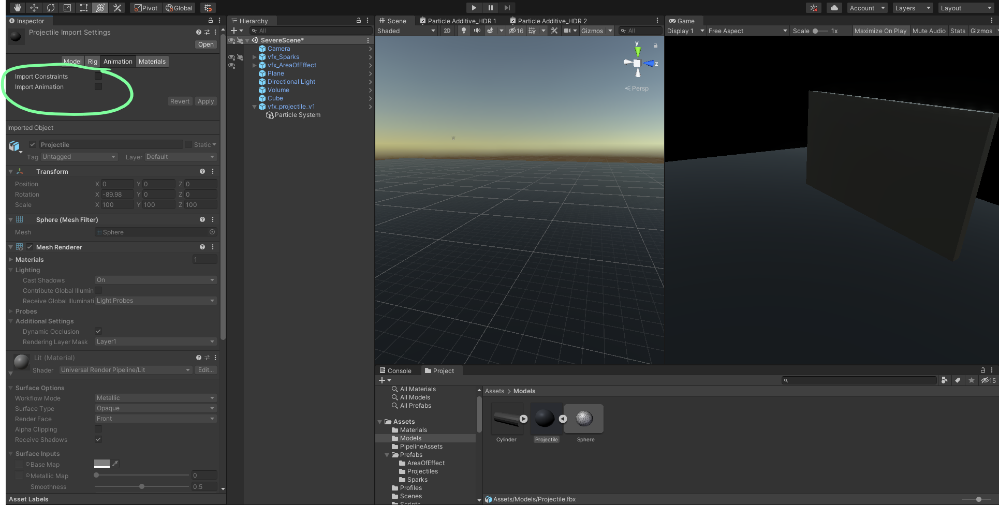

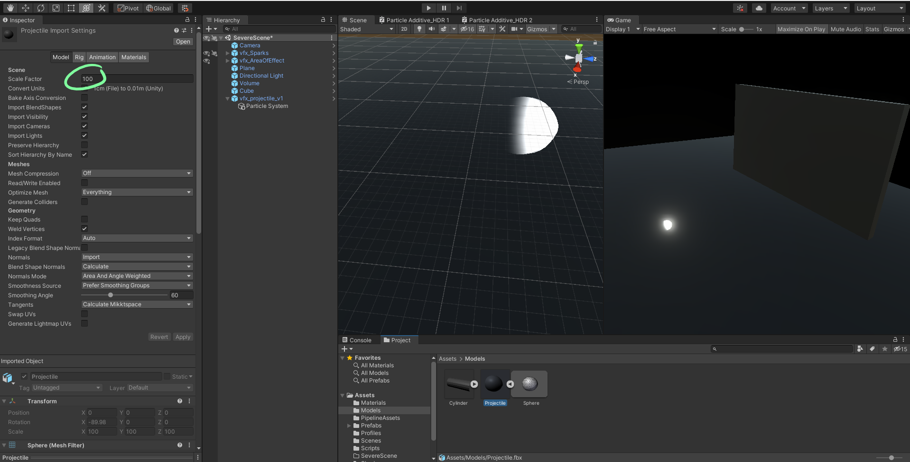

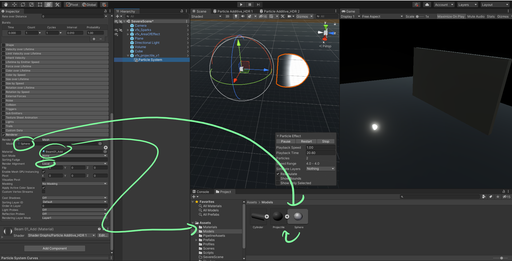

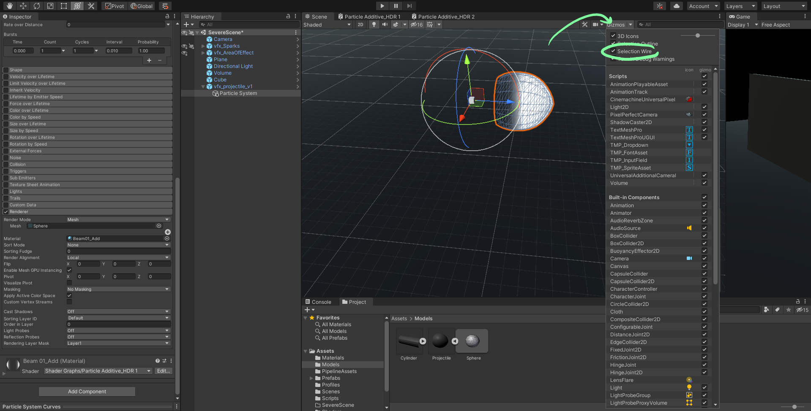