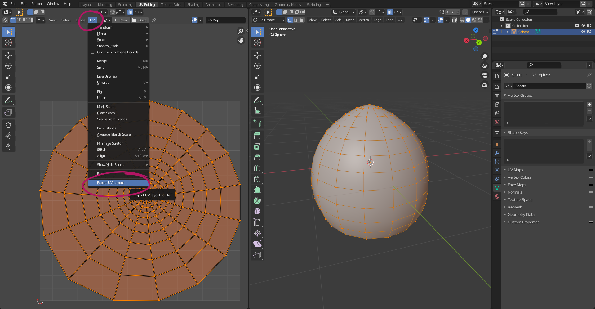
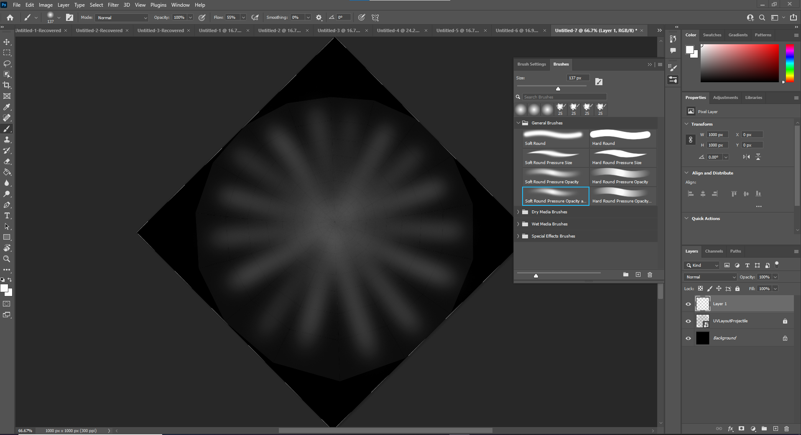
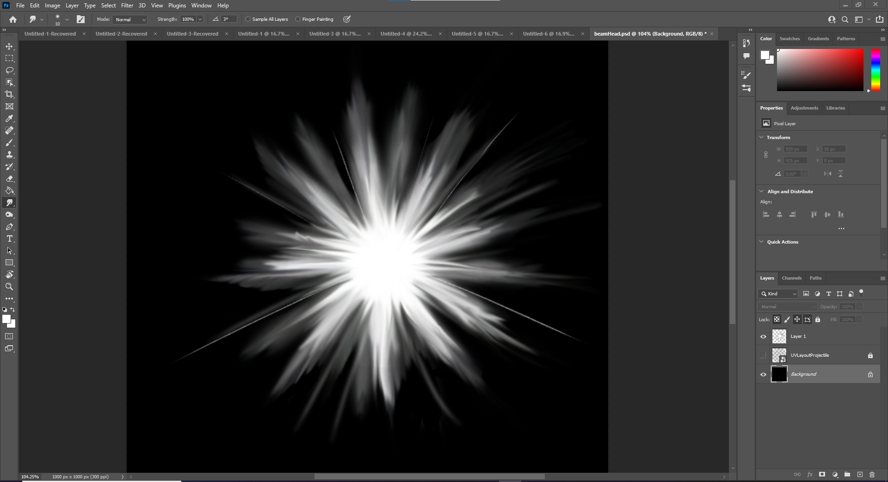
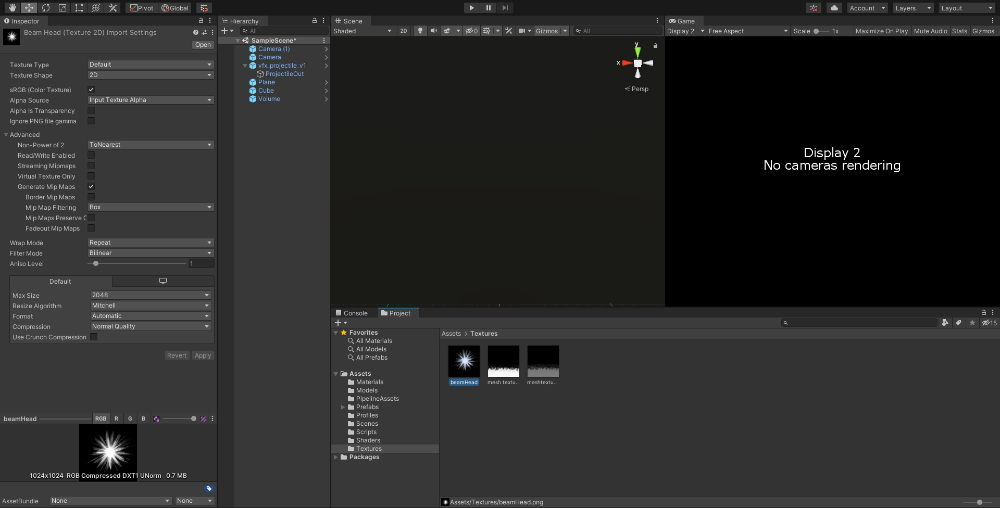
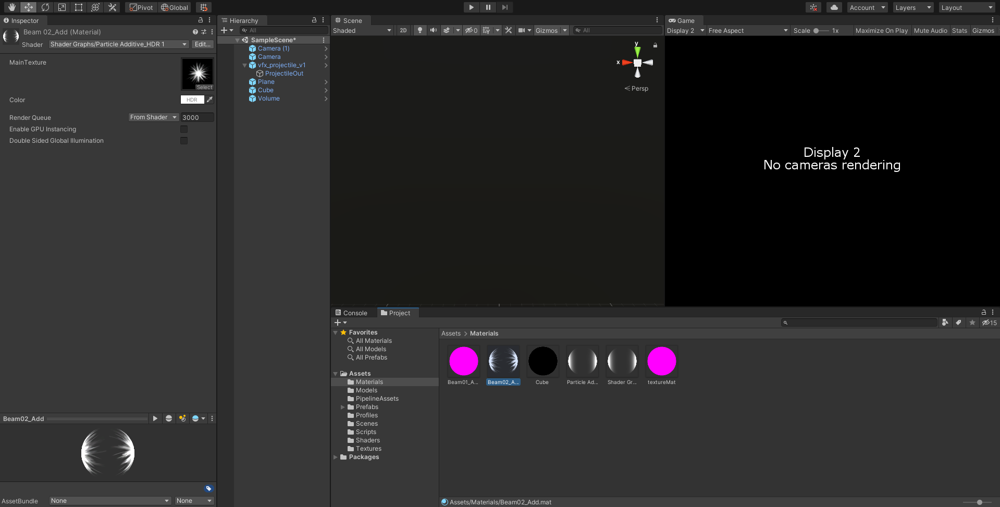
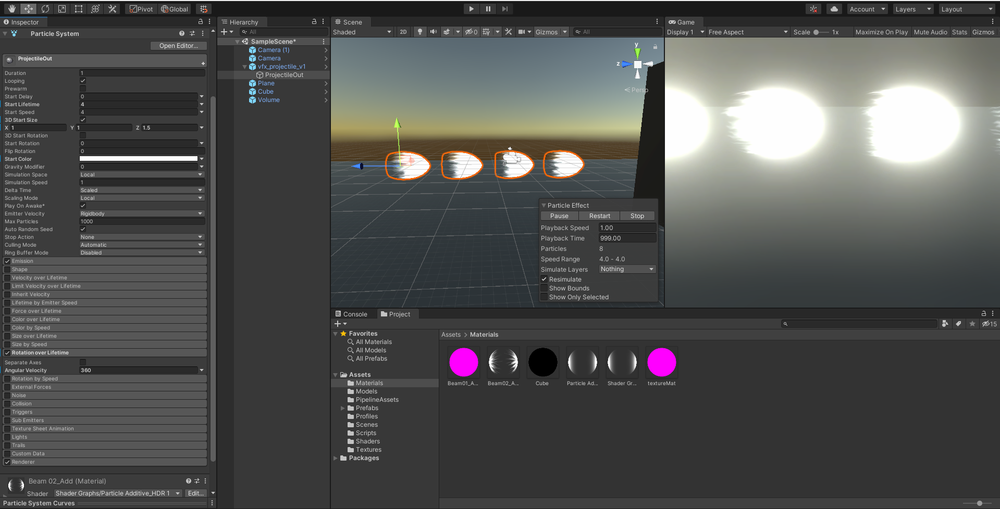

# DEV-24, Projectile Texture
#### Tags: [texture, uv]

## Exporting UV layout in blender

## Import the UV into photoshop

    Create a new layer and start drawing on top of the UV

## Bring the png into unity as a texture

## Add the texture to a material

## Base projectile

