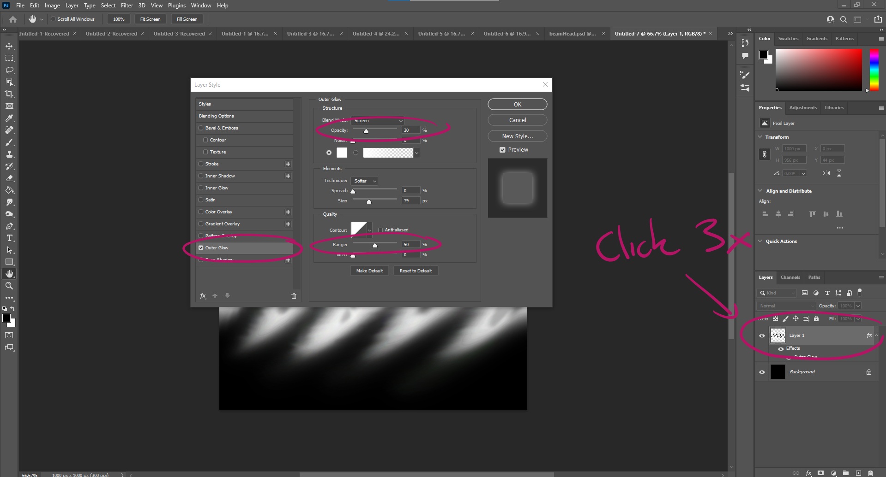

# DEV-25, Adding a trail effect
#### Tags: [trail, photoshop]

## Create tail for beam in Photoshop and then add glow

## Mirror off the horizontal axis

## Import to unity and create a trail

## Give the trail these settings

