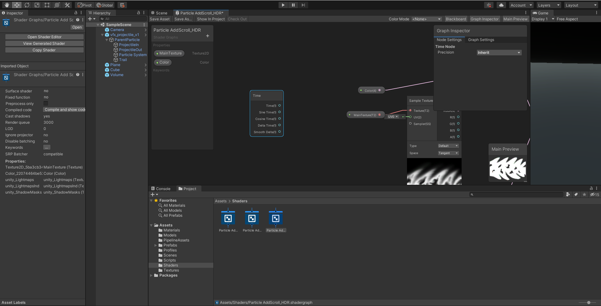
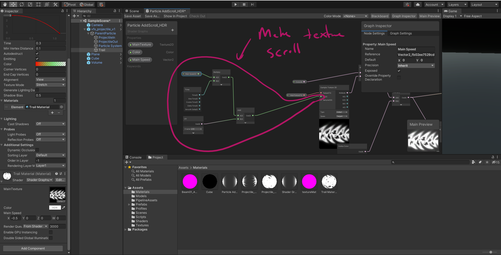
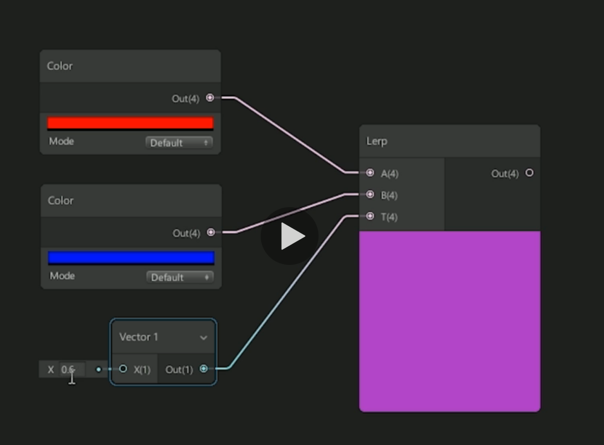
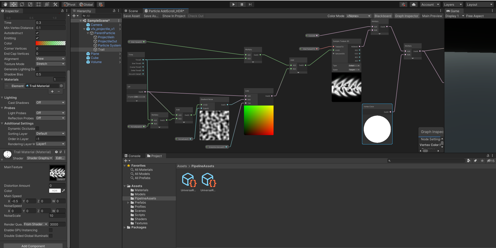

# DEV-26, Shader Graph - Additive Scroll and Distortion Shader
#### Tags: [shader graph]

## Time Node

    If you want something to move, likely you will be using the time node

    Fully functional scrolling

## Lerp Node

    A lerp node will output a mix between A and B according to the scalar T input. this scalar is a float between 0 and 1.
    in the image below, all red is 0 and all blue is 1, any decimal bettween 0 and 1 with give us some hue in between.

    Our lerp will take in the UV and some Gradient Noise, as well as a scalar. here is the whole wiring:

## Changes to Particle properties can be found in EXPORTS PROJ-04 DEV-26 (Theres too many changes)