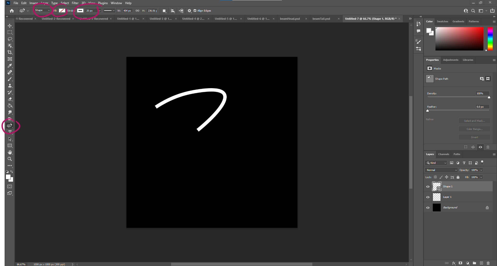
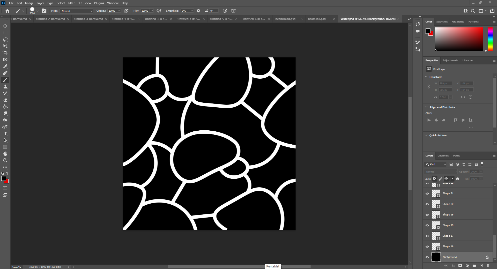
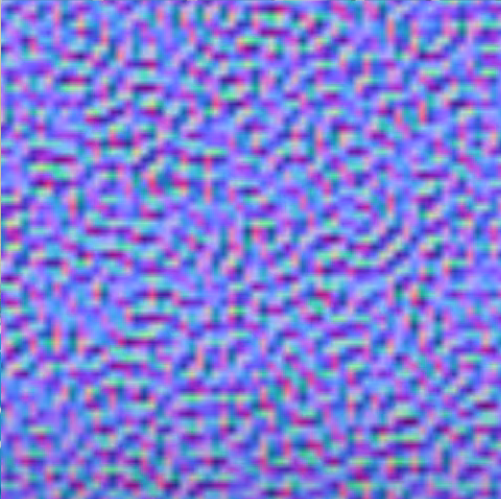

# DEV-27, Making some Windwaker water
#### Tags: [photoshop,, textures shaders]

## Link
    https://www.youtube.com/watch?v=NHy3rSKtRmc

## Using the curve pen tool

    Used the Brush tool to sketch potential circles and then used the Curvature Pen Tool to Finalize

## Our flow map

    This will contol the motion of the foam on the surface

