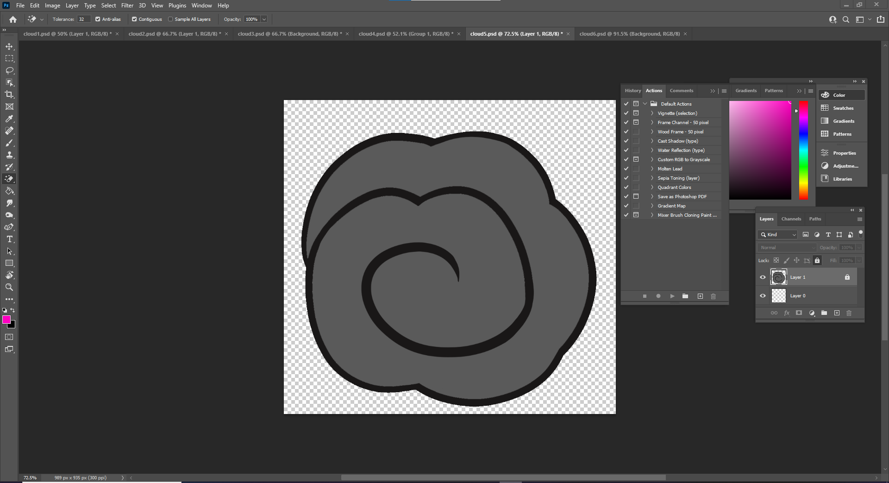
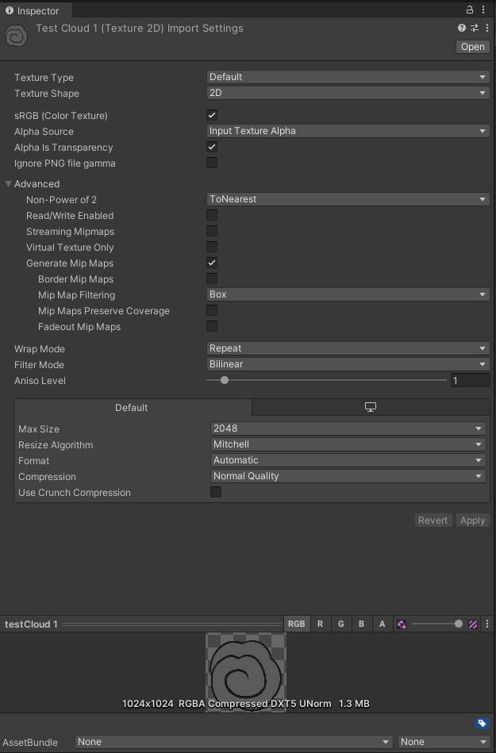

# DEV-28, Adding Transparent pngs to serve as particles
#### Tags: [photoshop, transparency, shaders]

## Create image

    Make sure the image has a transparent background

## Import into unity

    Make sure the texture has these settings

## Make sure shader Graph has these settings

    